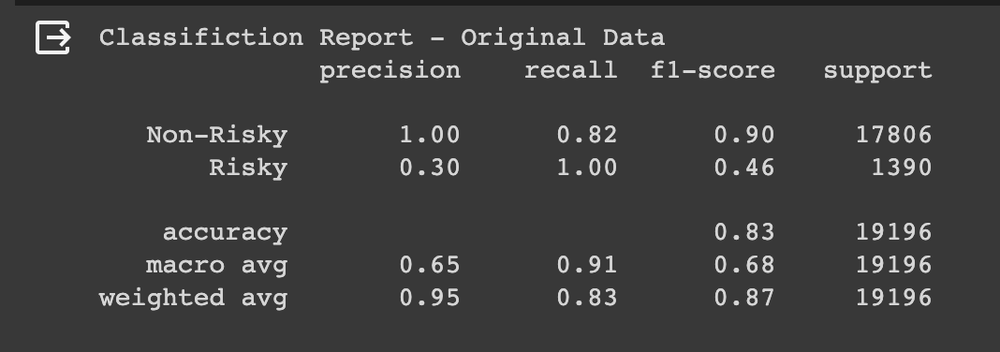

# Project 2: To Fail or Not To Fail?

The goal of this project is to analyze recent quarterly bank data and determine if we can predict bank classification as risky. In order to do this, the team investigated QoQ change in asset values and financial ratios before feeding into a machine learning model.

## Table of Contents
* [Files](#files)
* [General Information](#general-information)
* [Software and Technologies Used](#software-and-technologies-used)
* [Data Prep & Model Training Process](#data-prep-&-model-training-process)
* [Findings](#findings)
* [Use Cases](#use-cases)
* [What If We Had More Time](#what-if-we-had-more-time)
* [Team Information](#team-information)

## Files
* [Project Workbook](project_file.ipynb)
* [Model](/Model/risky_bank_model_final.json)
* [Weights](/Model/risky_bank_model_weights_final.h5)
* [Model Output](/Data/model_output.csv)
* [Data Source](/Data/bankdata.csv)

## General Information
Given recent regional bank turmoil and the collapse of Silicon Valley Bank (SVB), First Republic, and Signature, there is a spotlight from the FDIC, regulators, and the public on the financial condition of banks. The macro interest rate environment has led to low cash balances, securities depreciation, and riskier lending practices to stay competitive.  In doing so, banks open themselves up to higher levels of risk compared normal market cycles. 

When looking at specific ratios to indicate a banks “riskiness” rating, we looked at 3 different metrics. S/A (securities to assets), C/A (cash to assets), and L/D (loans to total deposits). In addition to these metrics, we also looked at quarterly percent change (increase or decrease) of total cash, assets, securities, loans, & deposits. Using these metrics we wanted to understand which banks may me at risk of liquidity issues or failure.

After identifying a risky bank, an investor or depositor might seek to change their relationship with the bank from a trading or personal perspective. 

## Software and Technologies Used
### Technology
* [Google Colab](https://colab.research.google.com/)
### Libraries
* [Pandas](https://pandas.pydata.org/docs/)
* [Pathlib](https://docs.python.org/3/library/pathlib.html)
* [Numpy](https://numpy.org/doc/stable/)
* [Keras](https://keras.io/)
* [SkLearn](https://scikit-learn.org/stable/)
### New Machine Learning Library
* [Normalizer](https://scikit-learn.org/stable/modules/generated/sklearn.preprocessing.Normalizer.html)

## Data Prep & Model Training Process
### Where was the data sourced
We used [BankRegData](https://www.bankregdata.com//main.asp)’s dataset/database to create a cohesive quarter over quarter dataset of all banks between 2019 and 2023. We picked this time period because over $800B of stimulus money entered the banking system during COVID and banks are starting to feel the rippling impact using these deposits. 

### What model was used
We mainly considered the size of our data and the complexity of the problem when determining which type of model to use. 

We planned on predicting liquidity issues and bank failures based on financial metrics like cash, assets, loans, deposits, etc., and decided a more advanced model would be better suited than a simple linear regression model given the complexity of the problem. Specifically, we compared linear regression, logistic regression and neural network models.

| | Linear Regression | Logistic Regression | Neural Network | Priority |
| ----- | ----- | ----- | ----- | ----- |
| **Purpose** | Regression | Binary classification | Regression & Classification | High |
| **Complexity** | Simple | Moderate | Complex | Medium |
| **Data / Training Data Size** | Small/Medium | Small/Medium | Large | High |
| **Applicability** | Linear Relationships | Binary classification | Versatile/Both | High |
| **Risk of overfitting** | Low | Moderate | High | High |
| **Computational Resources Used** | Low | Low/Moderate | High | Low |
 
Linear regression proved to be the simplest model, but has several limitations when it comes to our high priority needs. Logistic regression and neural networks offered us more flexibility and could handle a wider range of tasks. Ultimately, neural networks seemed the most appropriate for our training dataset and output requirements.

### Data preparation
1. Drop null values & standardize data types (i.e., convert to floats & date type)
2. Calculate critical metrics
* Securities to Assets (S/A) Ratio
* Cash to Assets (C/A) Ratio
* Loans to Deposits (L/D) Ratio
* Percent change quarter over quarter (QoQ) 
3. Drop unwanted rows/columns - For each of the banks in our dataset, we removed 
* Nulls. In our case, this resulted in removing the first quarter’s worth (dated “2019-03-31”) of data for each bank
* The last quarter’s worth (dated “2023-06-30”) of data so we could use it to predict risk once we had an established model 

For critical metrics, we grouped the data for each bank by quarter in order to determine QoQ change and establish a threshold for “riskiness”. Specifically, a bank had a “risky” quarter if it met the following criteria:
* S/A Ratio >= 0.20 (20%) and
* C/A Ratio <= 0.05 (5%) and
* L/D Ratio >= 0.70 (70%) 

As seen in the box plot below, the average for securities to asset ratio falls around 20%, with outliers holding securities above 70% of total assets.  Based on our model, we can infer that these banks are overexposed to securities. In the event the securities depreciate, the bank would be a high risk target.  Similarly, banks with low cash to asset ratios would experience similar concerns.  The average is around 5%, but there are some outliers that are holding between 25-98% cash. Most banks that could be considered risky hold a loan to deposit ratio around 75%, but there are some outliers holding above 100% and close to 0%. 

### Training the Model
When training the model, we attempted to identify a relationship between asset volume and calculated ratio levels (S/A, C/A , L/D) change QoQ to potential bank riskiness. 

When testing the model initially, we were faced with “Not a number” loss and loss greater than 1, which indicated we experienced a data leak issue. This caused us to remove the S/A, C/A, and L/D ratios as those numeric values were utilized to identify our training bank data. 

We tested different types of input data: percentage change, versus ratios, versus volume.  We decided the most optimal dataset would include volume and percent change of the volume metrics QoQ as this data is easily available via download and does not need additional manipulation. 

When reviewing the data, there were large spreads between the volume of assets between large banks and small banks.  In addition, the percent change values were all very small compared to the volume metrics.  Standard Scaler did not produce strong results in our model, which caused us to search for alternative options.  We identified Normalizer to use as we were dealing with large discrepant data sets and values that were positive and negative.  

After selecting and fixing data, we applied a dropout as the original model had very low accuracy (below 60%).  We tested different levels of dropouts and discovered a 20% dropout yielded the strongest results compared to 15% and 30%. 
 

In this model, we see poor recall at 66% meaning there were many false positives. 

In this optimization, we see recall increase to 100% for the Risky classification but the Non-Risky classification recall drops to 82% and the Risky precision falls to 30%, showing many false positives were predicted.

In optimization #3, we see recall fall to 3%, making this model very bad at predicting risky banks. 

Finally, to improve the model, we increased the number of epochs from 20 to 50 to improve our model even further.  This improved our model's recall to 0.77, while maintaining accuracy, f1-scores, and precision. 

### Final Classification Report

### Our model's structure

## Findings
After a few rounds of optimization, we were able to generate a relatively strong model that could predict risky banks at a 96% accuracy.  When applying a new data set we had for Q2’23, we were able to predict banks that were risky based on QoQ changes, current asset volumes, and indicator ratio combinations.

When running the predictions, we identified 15% of banks that could be considered high risk banks, primed for failure. 
| Risky | Non-Risky | Total |
| --- | --- | ---|
| 697 | 3823 | 4520 |

A list of risky banks, with high failure potential as of Q2’23 is saved here: 
[Final Risky Bank List](Data/model_output.csv) 

When looking at all the risky banks we can see some banks have high indicators of risk that area associated with the peaks in the data. 

## Use Cases
1. Predict upcoming liquidity issues and bank failures 
2. Determine banks that may be considered risky for short selling
3. Determine which banks are "safe" to invest in, working with, or depositing your money 

## What if we had more time...?
1. Continue to test new model optimizations to improve accuracy, recall, and precision of the model
2. Build in a dynamic dashboard to evaluate banks and showcase risky banks in visual formats
3. Build a dashboard that can automatically update based on new data uploads and is searchable for product use
4. Create a trading algorithm that trades on safe and risky banks based on the ratios and metrics

## Team Information
Group 1 - The Random Forests
**Team Members**: Dane Kunkel, Sreya Nalla, Brandon Anderson